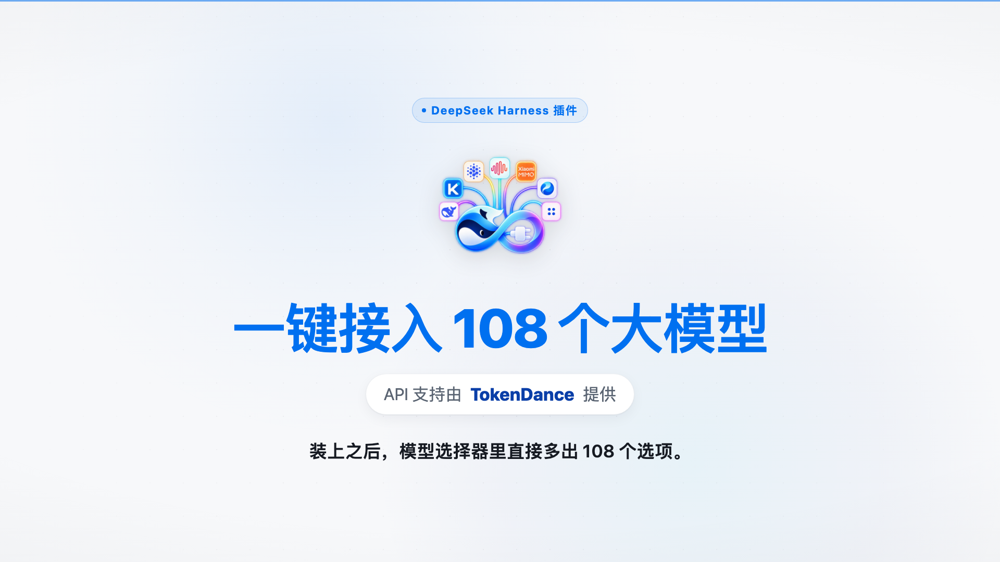

<p align="center">
  
</p>

<h1 align="center">OneKey-Models</h1>

<p align="center">
  <b>One-click access to all 108 latest models on TokenDance</b><br/>
  inside <a href="https://github.com/deepseek-ai/DeepSeek-Harness">DeepSeek Harness</a>
</p>

<p align="center">
  English · <a href="README.zh.md">简体中文</a>
</p>

<p align="center">
  <a href="#install">Install</a> ·
  <a href="#features">Features</a> ·
  <a href="#what-is-tokendance">What is TokenDance?</a> ·
  <a href="#how-it-works">How it works</a> ·
  <a href="#testing">Testing</a> ·
  <a href="#video">Video</a>
</p>

---

**API support provided by [TokenDance](https://tokendance.space).** This plugin is an independent client of the TokenDance API platform; it is not affiliated with or endorsed by TokenDance.

## Install

Clone the repository, then install it as a DSH bundle:

```bash
git clone https://github.com/du-yuxuan/OneKey-Models.git
```

**In the DSH chat**, ask the agent to install it:

```text
install_bundle target=/absolute/path/to/OneKey-Models
```

**Or from the CLI** (creates/uses a profile):

```bash
node <dsh>/lib/bin.js plugin --profile <profile-name> add /absolute/path/to/OneKey-Models
```

Restart DeepSeek Harness (or the profile session) after installing. The settings page appears under **Settings → Plugins → OneKey-Models**.

> Requires Node.js ≥ 22.19.0. Distribution is via this GitHub repository + `install_bundle`; the package is not published to npm.

## Features

| | Feature | What it does |
|---|---|---|
| 1 | **API key management** | OAuth (PKCE) sign-in opens the TokenDance authorization page; the returned key is stored locally in DSH's credentials store and **never appears in source code or logs**. |
| 2 | **Model list configuration** | Fetches the live catalog from `https://tokendance.space/gateway/v1/models`, lets you select multiple models, and choose which ones show up in the model picker (empty selection = show everything). |
| 3 | **Special model configuration** | Image-generation models are wired to their matching application (`openai:image-generations` / `ark:image-generations`); Jev judgment models are wired to the `typesafe:systemone` protocol — plus video, speech, audio, music, search, embedding and rerank models. |
| 4 | **Core capabilities** | Chat, image generation and multimodal (text + image) input all work out of the box, exposed both to the model picker and as four built-in tools (`tokendance_models`, `tokendance_chat`, `tokendance_image`, `tokendance_jev`). |

Enrichment data (logos, pricing, context windows, release dates, modalities) is synced automatically from [models.dev](https://models.dev).

### Catalog at a glance

```
catalog: 108 models from https://tokendance.space/gateway/v1/models
  jev 2 · image 3 · video 18 · embedding 2 · rerank 1
  speech 3 · audio 3 · music 2 · search 3
  routable 71 models
✓ catalog check passed (108 models, 71 routable)
```

`routable` = models whose protocol maps onto a DSH wire protocol (`openai-completions` / `openai-responses` / `anthropic-messages`) and therefore appear in the model picker.

## What is TokenDance?

**TokenDance is an AI model aggregation gateway** — think of it as one front door to many large models:

- **1 key, 1 base URL** — sign up once, get one API key, point any compatible SDK at one address.
- **108 of the latest, hottest models** — GLM, DeepSeek, Kimi, Qwen, MiniMax, Seedance, Doubao and more, kept up to date.
- **Pay as you go** — no per-vendor accounts, no juggling separate keys and billing pages.

New to all this? The short version: instead of registering with a dozen AI vendors and copying a dozen keys, you register once with TokenDance and this plugin wires every model straight into DeepSeek Harness's model picker.

This plugin does the wiring for you: **install → sign in once → pick your models → they appear in the picker.**

## How it works

```text
┌─────────────────┐   OAuth (PKCE)    ┌──────────────────────┐
│ DeepSeek Harness │ ───────────────▶ │ tokendance.space      │
│  OneKey-Models   │ ◀─────────────── │  authorization page   │
└────────┬────────┘   API key (local) └──────────────────────┘
         │                                          ▲
         │  write provider block                    │ GET /gateway/v1/models
         ▼                                          │ (live catalog)
┌─────────────────┐                                 │
│   llm-pi-ai      │ ────────────────────────────────┘
│   providers.     │
│   tokendance     │ ──▶ model picker: 108 models, 71 routable
└─────────────────┘
```

1. **Sign in** — the plugin opens the TokenDance authorization URL, receives a one-time code on a loopback callback, exchanges it for an API key, and stores it via DSH's credentials service (`~/.dsh/.credentials.yaml`, mode `600`).
2. **Pick models** — the live catalog is fetched, enriched with models.dev metadata, and written into the `llm-pi-ai` settings namespace as a provider block.
3. **Use them** — selected models show up in the model picker; image and Jev models additionally get dedicated tools.

All local HTTP endpoints are guarded by a loopback + `sec-fetch-site` trust fence (inbound requests must come from the local origin, never a cross-site page).

## Testing

```bash
npm test              # 57 unit tests (node:test)
npm run check:catalog # live catalog acceptance (108 models, 71 routable)
```

The unit suite covers config normalization, catalog mapping, the settings patch whitelist, Jev question validation, PKCE/OAuth URL construction, the trust fence, credential helpers, and the HTTP layer (exercised against a local stub gateway — no real key required).

## Video

<p align="center"></p>

75-second intro (1920×1080, 30 fps): [`out/intro.mp4`](out/intro.mp4) — built with [Remotion](https://www.remotion.dev/); sources in [`video/`](video/).

## Plugin page

The settings page shows the **“API support provided by TokenDance”** credit, the TokenDance brand mark, and a plain-language introduction of what TokenDance is.

## Repository layout

```text
index.js            Host half: settings, OAuth, catalog, HTTP routes, tools
client.js           Client half: settings page (slot + locale registration)
src/                config, catalog, credentials, http, image, jev, oauth,
                    patch, pi-ai, tools, trust
locale/             zh + en metadata
test/               node:test suites
scripts/            check-catalog.mjs, oauth-once.mjs
logo/               brand assets
video/              Remotion project
out/                intro.mp4 + poster
```

## License

[MIT](LICENSE). “TokenDance” is a trademark of its respective owner; this project is not affiliated with or endorsed by TokenDance. The API access it configures is provided by TokenDance.
